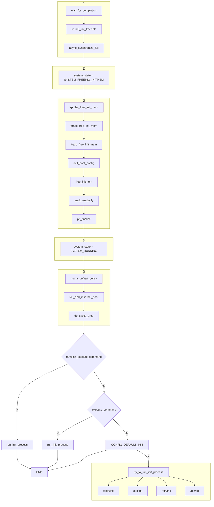
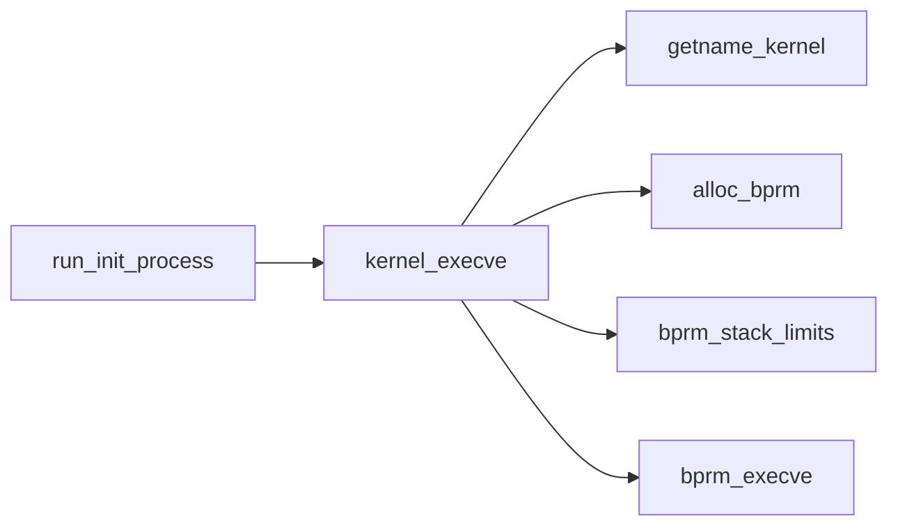

# 进程pid 0, pid 1, pid2

pid 0: swapper 进程，pid 1 和pid 2的父进程, /* pid 0 == swapper == idle task */
pid 1: init 进程，所有用户态进程的父进程
pid 2: kthreadadd所有内核态线程的父进程

## pid 0的诞生
```
#define INIT_TASK_COMM "swapper"
```
### init_task

```


struct task_struct init_task {
    ...
    .comm           = INIT_TASK_COMM,
    ...
}

// 设置current为init_task
DEFINE_PER_CPU_ALIGNED(struct pcpu_hot, pcpu_hot) = {
	.current_task	= &init_task,
	.preempt_count	= INIT_PREEMPT_COUNT,
	.top_of_stack	= TOP_OF_INIT_STACK,
};
EXPORT_PER_CPU_SYMBOL(pcpu_hot);
```

```
start_kernel
    sched_init
      WARN_ON(!set_kthread_struct(current)); //设置current 的kthread_struct, 对于内核线程的task_struct的worker_private即是kthread_struct
      init_idle(current, smp_processor_id());
        |---- __sched_fork(0, idle);  // 对于新fork的task进行关于调度的初始化设置，idle 也调用了此函数
        |---- idle->__state = TASK_RUNNING;
        |---- idle->se.exec_start = sched_clock();
        |---- idle->flags |= PF_KTHREAD | PF_NO_SETAFFINITY;
        |---- kthread_set_per_cpu(idle, cpu); // 设置运行cpu，及cpu亲和性
        |---- __set_task_cpu(idle, cpu);
        |---- rq->idle = idle;
        |---- rcu_assign_pointer(rq->curr, idle);
        |---- idle->on_rq = TASK_ON_RQ_QUEUED;
        |---- idle->on_cpu = 1;
        |---- idle->sched_class = &idle_sched_class; //设置调度class
        |---- ftrace_graph_init_idle_task(idle, cpu);
        |---- vtime_init_idle(idle, cpu); // vtime初始化
        |---- sprintf(idle->comm, "%s/%d", INIT_TASK_COMM, cpu); // idle comm swapper/cpu
```

# Init进程启动


```
start_kernel
    arch_call_rest_init
        rest_init
            |---- rcu_scheduler_starting
            |---- user_mode_thread(kernel_init, NULL, CLONE_FS)
            |---- ...
            |---- kernel_thread(kthreadd, NULL, NULL, CLONE_FS | CLONE_FILES)

```


```
__weak __noreturn 作用？？？
void __init __weak __noreturn arch_call_rest_init(void)
{
	rest_init();
}
```

## kernel_init工作流程
如下图所示：最终是调用了run_init_prcocess 启动了init进程。
通过代码分析可见，init进程可以通过三种方式进行启动：
1. initramfs中定义
2. 启动命令行
3. 内核默认配置项
4. 通过同种四个位置





```

static noinline void __init kernel_init_freeable(void)
{
	/* Now the scheduler is fully set up and can do blocking allocations */
	gfp_allowed_mask = __GFP_BITS_MASK;

	/*
	 * init can allocate pages on any node
	 */
	set_mems_allowed(node_states[N_MEMORY]);

	cad_pid = get_pid(task_pid(current));

	smp_prepare_cpus(setup_max_cpus);

	workqueue_init();

	init_mm_internals();

	rcu_init_tasks_generic();
	do_pre_smp_initcalls();
	lockup_detector_init();

	smp_init();
	sched_init_smp();

	workqueue_init_topology();
	padata_init();
	page_alloc_init_late();

	do_basic_setup();

	kunit_run_all_tests();

	wait_for_initramfs();
	console_on_rootfs();

	/*
	 * check if there is an early userspace init.  If yes, let it do all
	 * the work
	 */
	if (init_eaccess(ramdisk_execute_command) != 0) {
		ramdisk_execute_command = NULL;
		prepare_namespace();
	}

	/*
	 * Ok, we have completed the initial bootup, and
	 * we're essentially up and running. Get rid of the
	 * initmem segments and start the user-mode stuff..
	 *
	 * rootfs is available now, try loading the public keys
	 * and default modules
	 */

	integrity_load_keys();
}

```