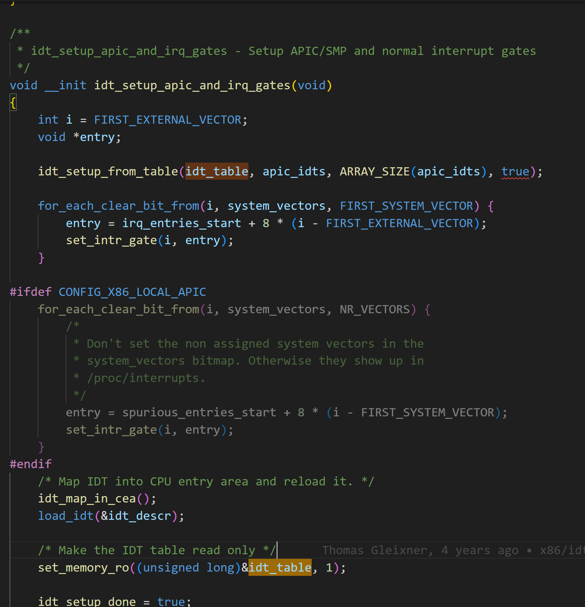

# IDT 初始化

## 全局变量idt_table



## load idt

cpu_init 完成后执行调用load_current_idt。


## 固定的segment __KERNEL_CS

### Linux GDT表

根据x86 64架构，GDT表项都是段描述符
```
DEFINE_PER_CPU_PAGE_ALIGNED(struct gdt_page, gdt_page) = { .gdt = {
#ifdef CONFIG_X86_64
	/*
	 * We need valid kernel segments for data and code in long mode too
	 * IRET will check the segment types  kkeil 2000/10/28
	 * Also sysret mandates a special GDT layout
	 *
	 * TLS descriptors are currently at a different place compared to i386.
	 * Hopefully nobody expects them at a fixed place (Wine?)
	 */
	[GDT_ENTRY_KERNEL32_CS]		= GDT_ENTRY_INIT(0xc09b, 0, 0xfffff),
	[GDT_ENTRY_KERNEL_CS]		= GDT_ENTRY_INIT(0xa09b, 0, 0xfffff),
	[GDT_ENTRY_KERNEL_DS]		= GDT_ENTRY_INIT(0xc093, 0, 0xfffff),
	[GDT_ENTRY_DEFAULT_USER32_CS]	= GDT_ENTRY_INIT(0xc0fb, 0, 0xfffff),
	[GDT_ENTRY_DEFAULT_USER_DS]	= GDT_ENTRY_INIT(0xc0f3, 0, 0xfffff),
	[GDT_ENTRY_DEFAULT_USER_CS]	= GDT_ENTRY_INIT(0xa0fb, 0, 0xfffff),
#else
....
#fi

// arch/x86/include/asm/desc_defs.h
#define GDT_ENTRY_INIT(flags, base, limit)			\
	{							\
		.limit0		= (u16) (limit),		\
		.limit1		= ((limit) >> 16) & 0x0F,	\
		.base0		= (u16) (base),			\
		.base1		= ((base) >> 16) & 0xFF,	\
		.base2		= ((base) >> 24) & 0xFF,	\
		.type		= (flags & 0x0f),		\
		.s		= (flags >> 4) & 0x01,		\
		.dpl		= (flags >> 5) & 0x03,		\
		.p		= (flags >> 7) & 0x01,		\
		.avl		= (flags >> 12) & 0x01,		\
		.l		= (flags >> 13) & 0x01,		\
		.d		= (flags >> 14) & 0x01,		\
		.g		= (flags >> 15) & 0x01,		\
	}

enum {
	GATE_INTERRUPT = 0xE,
	GATE_TRAP = 0xF,
	GATE_CALL = 0xC,
	GATE_TASK = 0x5,
};
```


## 构建IDT entry

IDT 表中存储的门描述符

segment selector，必须是GDT 中定义的段。
而GDT中存储的是段线性地址，即__KERNEL_CS
segment offset是函数在内核代码段的地址

问题：地址哪里来的

```
static const __initconst struct idt_data def_idts[] = {
	INTG(X86_TRAP_DE,		asm_exc_divide_error),
	INTG(X86_TRAP_NMI,		asm_exc_nmi),
```

见： https://wiki.osdev.org/Interrupt_Descriptor_Table#Gate_Descriptor_2

* Offset: A 64-bit value, split in three parts. It represents the address of the entry point of the Interrupt Service Routine.
* Selector: A Segment Selector with multiple fields which must point to a **valid code segment in your GDT**.
* IST: A 3-bit value which is an offset into the Interrupt Stack Table, which is stored in the Task State Segment. If the bits are all set to zero, the Interrupt Stack Table is not used.
* Gate Type: A 4-bit value which defines the type of gate this Interrupt Descriptor represents. In long mode there are two valid type values:
  * 0b1110 or 0xE: 64-bit Interrupt Gate
  * 0b1111 or 0xF: 64-bit Trap Gate
* DPL: A 2-bit value which defines the CPU Privilege Levels which are allowed to access this interrupt via the INT instruction. Hardware interrupts ignore this mechanism.
* P: Present bit. Must be set (1) for the descriptor to be valid.
In your Interrupt Service Routines, remember to return from the interrupt using the IRETQ instruction instead of IRET, as assemblers will not translate that for you. Many 64-bit IDT related problems on the forum are caused by that missing 'Q'. Don't let this happen to you.

For more information, see Section 6.14.1: 64-Bit Mode IDT and Figure 6-8: 64-Bit IDT Gate Descriptors of the Intel Software Developer Manual, Volume 3-A.

```
#define DECLARE_IDTENTRY(vector, func)					\
	asmlinkage void asm_##func(void);				\
	asmlinkage void xen_asm_##func(void);				\
	__visible void func(struct pt_regs *regs)

```
## 构建IDT table

```
static __init void
idt_setup_from_table(gate_desc *idt, const struct idt_data *t, int size, bool sys)
{
	gate_desc desc;

	for (; size > 0; t++, size--) {
		idt_init_desc(&desc, t);
		write_idt_entry(idt, t->vector, &desc);
		if (sys)
			set_bit(t->vector, system_vectors);
	}
}

static __init void set_intr_gate(unsigned int n, const void *addr)
{
	struct idt_data data;

	init_idt_data(&data, n, addr);

	idt_setup_from_table(idt_table, &data, 1, false);
}

```
```
#define G(_vector, _addr, _ist, _type, _dpl, _segment)	\
	{						\
		.vector		= _vector,		\
		.bits.ist	= _ist,			\
		.bits.type	= _type,		\
		.bits.dpl	= _dpl,			\
		.bits.p		= 1,			\
		.addr		= _addr,		\
		.segment	= _segment,		\
	}

/* Interrupt gate */
#define INTG(_vector, _addr)				\
	G(_vector, _addr, DEFAULT_STACK, GATE_INTERRUPT, DPL0, __KERNEL_CS)

/* System interrupt gate */
#define SYSG(_vector, _addr)				\
	G(_vector, _addr, DEFAULT_STACK, GATE_INTERRUPT, DPL3, __KERNEL_CS)

/*
 * Interrupt gate with interrupt stack. The _ist index is the index in
 * the tss.ist[] array, but for the descriptor it needs to start at 1.
 */
#define ISTG(_vector, _addr, _ist)			\
	G(_vector, _addr, _ist + 1, GATE_INTERRUPT, DPL0, __KERNEL_CS)

/* Task gate */
#define TSKG(_vector, _gdt)				\
	G(_vector, NULL, DEFAULT_STACK, GATE_TASK, DPL0, _gdt << 3)
```