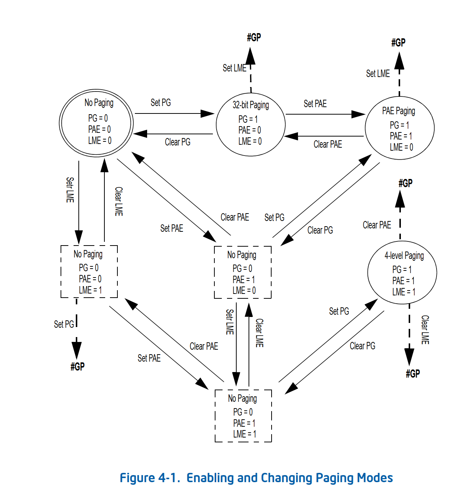
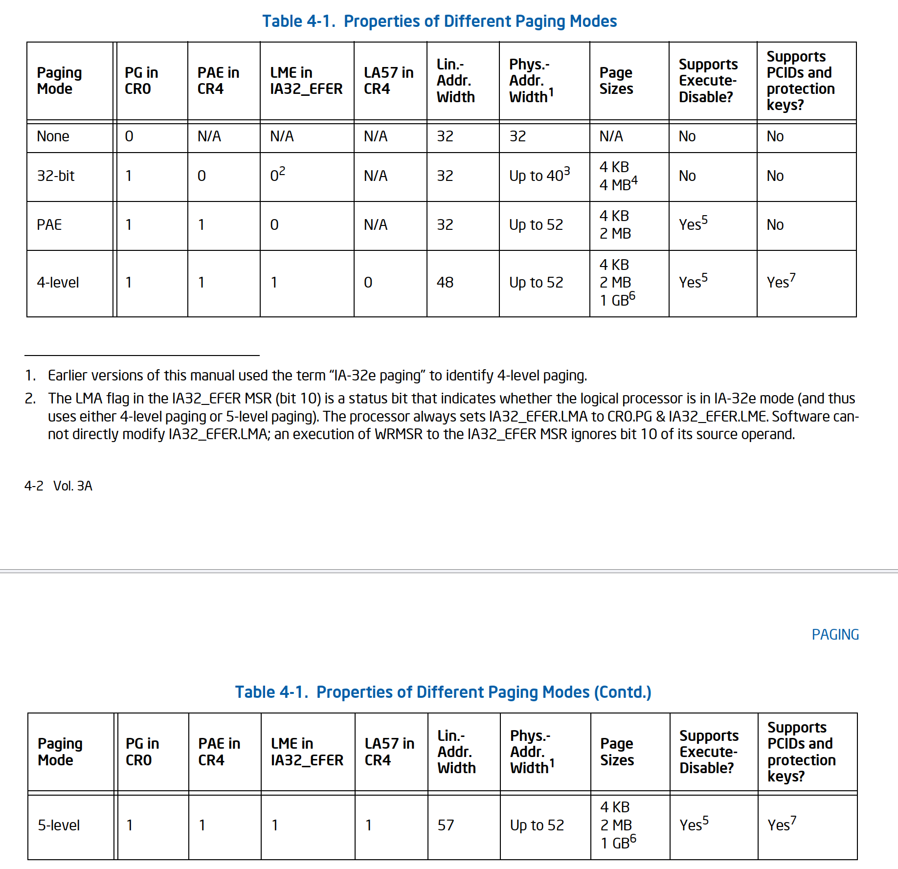

# Paging

>>> 来源intel vol3A Ch4 paging

Intel-64处理器有四种paging mode。控制分页的控制寄存器

CR0.PG = 0 ： 分页未开启

CR0.PG = 1 : 分页开启，分页只能在保护模式（CR0.PE = 1）被开启的情况下才能开启分页

 * 32-bit paging : CR4.PAE = 0
 * PAE paging: CR4.PAE = 1 and IA32_EFER.LME = 0
 * 4-level paging: CR4.PAE = 1, IA32_EFER.LME = 1, and CR4.LA57 = 0
 * 5-level paging: CR4.PAE = 1, IA32_EFER.LME = 1, and CR4.LA57 = 1

32-bit paging 和 PAE 模式仅传统保护模式支持，因为传统保护模式不能生成大于32bit的线性地址，32-bit paging和PAE转换32-bit 线性地址。
4-level & 5-level 分页仅在IA-32e模式中支持，IA-32e保护两种子模式：
* 兼容模式，仅支持32-bit线性地址，4-level & 5-level页表中63:32 都被认为是0
* 64-bit模式，虽然此子模式生成64位线性地址，但处理器强制执行规范性，这意味着此类地址的高位是相同的：63:47用于4级分页，位63:56用于
5级分页。4级分页不使用位63:48此类地址。





详见： vol 3A - ch4 （page 108）

Linux kernel arch/x86/include/asm/pgtable_64_types.h 中定义4级页表和5级页表结构，可以用来明确x86_64的页表结构。


```

/* Initialize variables for 5-level paging */
#ifdef CONFIG_X86_5LEVEL
	if (__read_cr4() & X86_CR4_LA57) {
		__pgtable_l5_enabled = 1;
		pgdir_shift = 48;
		ptrs_per_p4d = 512;
	}
#endif

ifdef CONFIG_X86_5LEVEL
/*
 * PGDIR_SHIFT determines what a top-level page table entry can map
 */
#define PGDIR_SHIFT	pgdir_shift
...
/*
 * 4th level page in 5-level paging case
 */
#define P4D_SHIFT		39
...
#define MAX_POSSIBLE_PHYSMEM_BITS	52

#else /* CONFIG_X86_5LEVEL */
/*
 * PGDIR_SHIFT determines what a top-level page table entry can map
 */
#define PGDIR_SHIFT		39
...

#endif /* CONFIG_X86_5LEVEL */
/*
 * 3rd level page
 */
#define PUD_SHIFT	30

/*
 * PMD_SHIFT determines the size of the area a middle-level
 * page table can map
 */
#define PMD_SHIFT	21

```

## Paging Structures


### Paging Structure entry

# Protection

在保护模式中，段特权有4级，分页特权2级


# 其他了解记录

## PCID、INVPCID

来自chatgpt

x86 CPU 的 PCID (Process Context Identifier) 特性是一种优化 CPU 内存管理性能的技术。它的主要作用如下:

* 加速 TLB（Translation Lookaside Buffer）切换:
  * TLB 是 CPU 用于缓存页表映射的高速缓存。
  * 当进程切换时,需要将旧进程的 TLB 条目全部刷新,然后加载新进程的 TLB 条目。
  * PCID 特性为每个进程分配一个唯一的标识符,使得 CPU 无需全部刷新 TLB,只需切换到相应进程的 TLB 条目即可。这大幅提高了进程切换的性能。
* 减少 TLB 未命中:
  * PCID 可以识别不同进程的 TLB 条目,CPU 可以更好地预测 TLB 命中情况。
  * 这进一步减少了 TLB 未命中的情况,提升了内存访问性能。
* 支持无特权级切换:
  * 传统情况下,进程特权级切换（如从用户态到内核态）都需要刷新整个 TLB
  * PCID 特性允许 CPU 在特权级切换时仅需切换相应的 PCID,不需要完全刷新 TLB。这进一步提高了特权级切换的效率。

总的来说，PCID 特性通过为每个进程分配唯一标识符来优化 TLB 管理,显著提高了进程切换和内存访问的性能。这对于需要频繁进程切换的操作系统内核来说非常重要。PCID 特性最早在 Intel Sandy Bridge 微架构上引入,现已成为 x86 CPU 的标准功能之一。

X86_FEATURE_INVPCID 是 x86 CPU 的另一个与进程上下文管理相关的重要特性。它的主要作用如下:

* 提供 INVPCID 指令:
  * INVPCID 指令可以有选择性地删除 CPU 的 Process Context Identifier (PCID) 缓存条目。
  * 这个指令可以用来更高效地管理 TLB 和页表映射,比传统的 INVLPG 指令更加灵活和高效。
* 优化 TLB 管理:
  * 通过 INVPCID 指令,操作系统内核可以针对性地删除某个进程的 TLB 条目,而不需要全局刷新 TLB。
  * 这进一步提高了进程切换和内存管理的性能,因为 TLB 不需要全部失效。
* 支持更高效的页表更新:
  * 在更新页表映射时,内核可以使用 INVPCID 指令删除特定进程的 TLB 条目,而不需要全局刷新 TLB。
  * 这避免了不必要的 TLB 失效,提高了页表更新的效率。
* 增强安全性:
  * INVPCID 指令可以用于更精确地控制 TLB 条目的生命周期,从而增强系统的安全性。
  * 例如,在进程终止时可以确保其 TLB 条目被彻底删除,防止信息泄露。
总的来说，X86_FEATURE_INVPCID 特性通过提供 INVPCID 指令,进一步优化了 x86 CPU 的 TLB 和进程上下文管理,在提高性能的同时也增强了系统的安全性。它是 x86 体系结构中非常重要的一个特性。