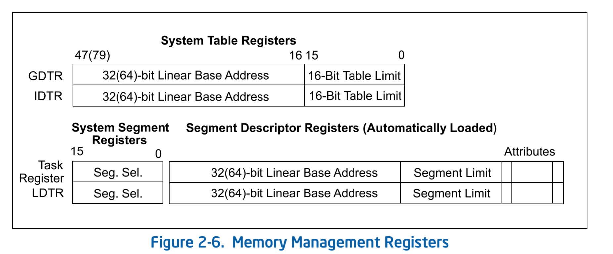

# system architecture overview

[toc]

## CPU运行模式
* 保护模式
* 实模式
* 系统管理模式(System management mode SMM)
  * SMM是从Intel386开始的标准架构特性，通常用于实现电源管理和OEM的不同特性。进入SMM模式是通过外部系统中断(SMI#)。SMM模式中，处理器进入独立的地址空间用于保护当前正在运行的程序或者任务。SMM模式返回后，cpu状态切换回之前的状态。
* Virtual-8086模式
* IA-32e模式，Intel 64位架构支持的模式，支持兼容模式和64-bit模式。64-bit模式提供64bit线性地址空间，并且支持物理地址空间大于64GB。兼容模式允许大部分的传统保护模式(legacy protected-mode)应用程序可以无修改的运行。

## 2.1 GDT/LDT (Global and Local Descriptor Tables)

保护模式下，所有的内存访问都是通过GDT/LDT，GDT/LDT表中是段描述符，段描述提供了段的基地址，访问权限，类型和使用信息。

访问段中的字节，需要一个段选择符(segment selector)，段选择符是GDT/IDT表的index，从表中读取线性低级空间的段基地址。

GDTR: 保存了GDT的线性地址基地址；LDTR：保存了LDT的线性基地址。IA-32 和IA-32e的区别就是IA-32eGDTR/LDTR扩展到了64bit，且兼容IA-32

## 2.2 System Segments, Segment Descriptors and Gates

除了代码段、数据段和堆栈段之外，架构还定义了两种系统段：TSS和LDT。GDT不认为是系统段，因为GDT的访问不是通过段选择符和段描述符的方式进行的。

### 2.2.1 TSS 和Task Gates

TSS定义的是一个任务执行环境的状态，包括通用寄存器、段寄存器、EFLAGS寄存器、EIP寄存器、和segment selectors with stack pointers for three stack segments (one stack for each privilege level)，以及与task关联的LDT的段选择符(segment selector)，和（页表基地址？？）the base address of the paging-structure hierarchy.

当前task的TSS的segment selector 存储在task register（任务寄存器中），切换task的指令是CALL/JMP，CALL/JMP指令中的给出新的task的TSS的segment selector，执行如下操作：
1. 存储当前的task的状态到current TSS
2. 将new task的TSS segment selector加载到task registor中
3.  访问GDT中new task TSS的segment descriptor
4.  从new TSS从获取通用寄存器、段寄存器、LDTR、控制寄存器CR3（页表基址寄存器），EFLAGS register 和EIP registor
5.  开始执行新的task

task也可以通过task gate的方式进行访问，task gate和call gate类似，不同之处是，task gate是通过段选择符访问TSS，而call gate是访问的code segment。

注意：IA-32e模式下硬件的task切换是不支持的，但是TSS还是存在的。64-bit TSS还保存了以下信息：

* 每个优先级层的栈指针地址
* interrup stack table的指针地址
* Offset address of the IO-permission bitmap (from the TSS base)

一种特殊的描述符被成为gate（call gates, interrupt gates, trap gates, and task gates）.

## 2.3 中断和异常的处理

外部中断、软中断、异常都是通过IDT进行处理的。IDT存储了门描述符（Gate Descriptor），门描述符指向中断或异常的处理入口。同GDT一样，IDT也不是segment。IDT的基地址存储在IDTR中。

IDT中的门描述符可以是中断、陷入（trap）、任务门描述符(task gate descriptors)。触发中断或者异常处理，是由处理器从外部中断控制器，或者软中断（INTx指令 或 BOUND 指令）获取到中断向量，中断向量作为IDT索引，获取IDT的中断处理函数地址。如果获得的门描述符是中断或者陷入，那么处理流程跟调用门(call gate)类似，如果描述符是任务门描述符，则触发的是任务切换。

## 2.4 内存管理

系统架构支持直接物理地址访问也支持虚拟机地址访问（分页）。物理地址访问，线性地址直接作为物理地址访问物理内存。分页的场景下所有的代码段、数据段以及系统段（包括GDT/IDT）都会被分页存储在物理内存中。CR3寄存器存储了页表地址，通过图看，CR3中存储的是物理内存地址，不是虚拟地址。

有几个地址概念：逻辑地址(logical address)、线性地址(linear address)、物理地址(physical adress)

### 2.4.1  物理地址

### 2.4.2 线性地址

#### 2.1.1 物理地址空间

### 2.1.2  线性地址空间

### 2.2 地址

## 2.5 系统寄存器
为了帮助处理器初始化和控制系统操作，系统架构提供了EFLAGS寄存器提供系统标志，以及系统寄存器：

- The system flags and IOPL field in the EFLAGS register control task and mode switching, interrupt handling, instruction tracing, and access rights.
- 控制寄存器(CR0 CR2 CR3 CR4)包含了flags和数据域控制系统操作。
- Debug REgisters
- GDTR LDTR IDTR 
- MSR（model specific registers）

### EFLAGS 寄存器

####  内存管理寄存器

### 控制寄存器

CR0: 包含系统控制flag

CR1: 保留

CR2：page fault 线性地址

CR3:  页表基址和两个flag（PCD, PWT）

CR4: 一系列系统能力，架构扩展相关的flag. 63-32 是IA-32e 模式下使用的，

CR8: 读写TPR（Task priority register）

CR0.PG (bit31): 为1开启分页，PE为0的情况下，设置PG为1，触发#GP

CR0.PE(bit0): 为1开启保护模式，为0进入实模式

CR4.PSE: 32bit 下的page size严格4KB，设置为1，page size为4MB；

CR4.PAE：Physical Address Extension (bit 5 of CR4).允许产生超过32bit的物理地址，如果为0则，只能产生32bit的物理地址，IA-32e模式PAE必须为1

CR4.MCE: Machine-Check Enable (bit 6 of CR4) ，**Machine-chec**k enable，为1则开启machine-check异常，为0则关闭machine-check异常

CR4.PGE: Page Global Enable (bit 7 of CR4)

CR4.OSXSAVE [bit 18]

详细见: CH2 2.5

EIP：指令指针寄存器，用于保存当前代码段的下一条执行指令，不能直接被软件访问，通过JMP,Jcc, CALL RET, IRET，中断和异常 执行设置

### 

## TODO

logical processor :  开启了HT（超线程技术后），超线程即为logical processor

core: 物理cpu core

slots：cpu插槽

sblings: 同一个物理core，开启了HT之后的logical processors
