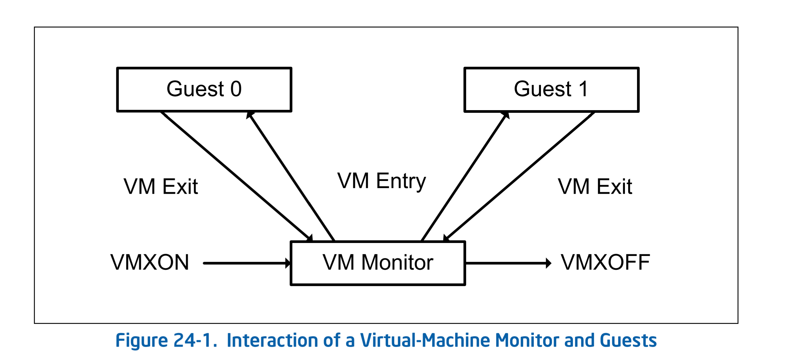
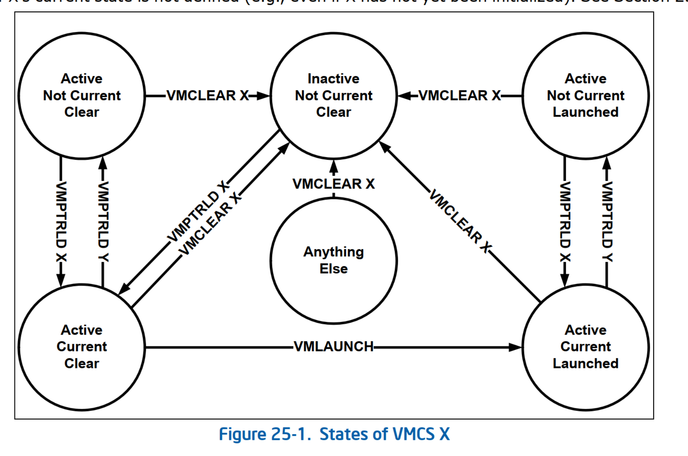

# virtual machine extensions

[toc]

判断是否支持VMX

CPUID.1:ECX.VMX[bit 5] = 1  

## 使能vmx

step 1 ： 设置CR4.VMXE[bit 13] = 1 

step2 :  执行vmxon指令。如果没有设置cr4, vmxon指令返回#UD

vmxon执行完成后，系统进入vmx operation 模式，可以执行vmx相关指令，vmx 状态下，不可以设置cr4 关闭vmx

执行vmxon指令之前，需要分配一个4KB内存成为VMXON region

## 关闭vmx

step1: vmxoff 指令

step2: 清空cr4.vmxe

current priviledge level (CPL)

## RESTRICTIONS ON VMX OPERATION  

在vmx 模式下，处理器可以固定cr0, c4的一些值，不支持更改，通过MSR  IA32_VMX_CR0_FIXED0  IA32_VMX_CR0_FIXED1  IA32_VMX_CR4_FIXED0 IA32_VMX_CR4_FIXED1  


## unrestricted guest  

默认vmx下，CR0.PE and CR0.PG   

## VMM 生命周期

VMXON：开启VMX操作

VMEntry：VMM使用VMLAUNCH/VMRESUME指令，进入到non-root模式，执行guest os

VMExit：

VMXOFF：VMM决定关闭VMX操作，执行VMXOFF指令




使能VMX

- CR4.VMXE[bit 13] = 1  

- VMXON, if CR4.VMXE[bit 13] = 0, then #UD，VMXON执行后， CR4.VMXE不能清0

注：VMXON 也有MSR控制， IA32_FEATURE_CONTROL MSR (MSR address 3AH)， IA32_FEATURE_CONTROL MSR (MSR address 3AH) 控制着VMXON，当逻辑处理器被重置reset时这个MSR会被清0。这个MSR相关的bit如下：

Bit 0 is the lock bit。这个bit位被清除，执行VMXON，触发**#GP**(general-protection exception)，该位被设置时，对这个MSR执行WSMSR则触发#GP，直到power-up reset ，MSR才能够被修改。**BIOS通过设置这个MSR来控制关闭和开启VMX**。BIOS还必须设置bit1和bit2.

Bit 1 enables VMXON in SMX (Safer Mode Extensions)operation. 如果此位为0，SMX操作下执行VMXON会触发**#GP**

Bit 2 enables VMXON outside SMX operation。如果此位为0，SMX操作之外执行VMXON触发**#GP**


关闭VMX

VMXOFF。VMXOFF 后，CR4.VMXE 可以被清除。


## VMCS（virtual-machine control struct）

VMX non-root 操作和VMX转换是由VMCS数据结构控制的。VMCS的访问通过处理器状态的一个组件，即VMCS指针（每个逻辑处理器一个）来管理。VMCS指针的值是VMCS的64位地址。

* 使用`VMPTRS`T和`VMPTRLD`指令读取和写入VMCS指针
  * VMPTLD指令，操作数是VMCS的内存地址，执行后VMCS被激活（active），且为current VMCS，其他的VMCS可能也是active的，但不是current VMCS
  * VMPTRS指令执行后，将current VMCS地址存储在一个特殊的内存地址中(如果没有current VMCS，则存储FFFFFFFF_FFFFFFFFH  )

* VMM使用`VMREAD`、`VMWRITE`和`VMCLEAR`指令配置VMCS
  * VMCLEAR，操作数是VMCS内存地址，执行后，VMCS launch state是clear
  * VMLAUNCH执行时，VMCS launch state需要时clear，执行后为lanched
  * VMRESUME执行时，MCS launch state需要时lanched
  * 注：VMCS的launch state不可以被`VMREAD` 读取，也不可以被`VMWRITE`主动修改


对于VMM支持的每个虚拟机，VMM都可以使用不同的VMCS。对于具有多个逻辑处理器（虚拟处理器）的虚拟机，VMM可以为每个虚拟处理器使用不同的VMCS。

申请一块vmcs region 内存够，指向内存的指针必须是4KB对齐的物理地址。



### 组成部分：

#### Guest-state area 

寄存器状态部分

控制寄存器：CR0/CR3/CR4

debug寄存器：DR7

RSP RIP RFLAGS

CS SS DS ES FS GS LDTR TR:

- selector(16 bit)

- Base address (64 bits / 32 bits )

- Segment limit(32 bits)

- Access rights (32 bits)

GDTR IDTR 

- base address
- Limit

The following MSRs 

The shadow-stack pointer register SSP : 

The register SMBASE   

非寄存器状态部分

Activity state (32 bits)  ： 逻辑处理器的activity state

Interruptibility state (32 bits)  

Pending debug exceptions (64 bits; 32 bits  )

**VMCS link pointer (64 bits).**： 指向当前VMCS的地址   

VMX-preemption timer value (32 bits).   

Page-directory-pointer-table entries (PDPTEs; 64 bits each).   

Guest interrupt status (16 bits).   

PML index (16 bits).   


#### Host-state area

#### VM-execution control fields


#### VM-exit control fields

#### VM-exit information fields


## VMXON

VMX 下CR9的固定位，由两个MSR决定：

IA32_VMX_CR0_FIXED0

IA32_VMX_CR0_FIXED1

以下伪代码表述CR0与这两个MSR之间的逻辑关系

```
if (IA32_VMX_CR0_FIXED1[bit_x] == 1 && IA32_VMX_CR0_FIXED0[bit_X] == 1) 
{
	CR0[bit_X] = 1; // Fix the bit to 1 in CR0 
} else if (IA32_VMX_CR0_FIXED0[bit_X] == 0 && IA32_VMX_CR0_FIXED1[bit_X] == 0) { 
	CR0[bit_X] = 0; // Fix the bit to 0 in CR0 
} else { 
	// If not fixed, the bit can be flexible (0 or 1) in CR0
}
```

